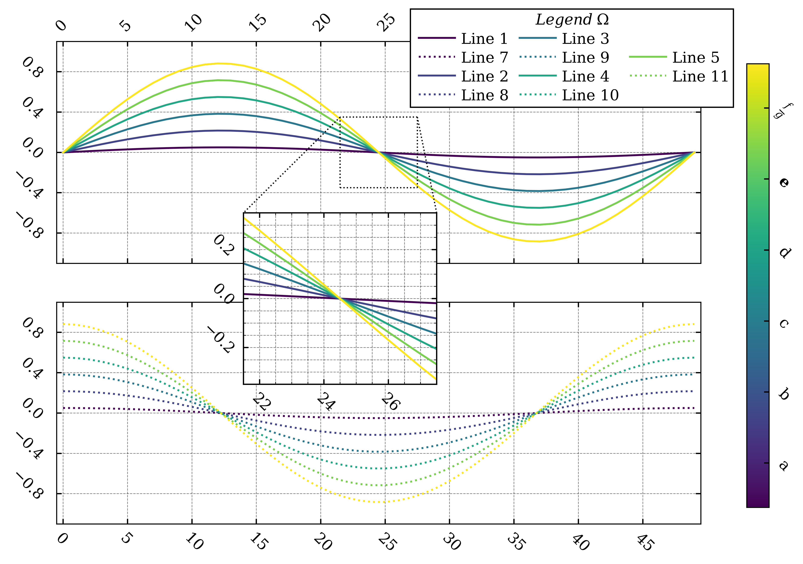

**journal_figure** is a library for journal-level data plotting.
The library comes with examples and pre-defined styles. 

Example figure:


---
**Install** journal_figure from GitHub (system-wise from console):
```console
python -m pip install git+https://github.com/martin-garaj/journal_figure.git@main
```

---
**RE**install journal_figure from GitHub (system-wise from console):
```console
python -m pip install git+https://github.com/martin-garaj/journal_figure.git@main --force-reinstall
```

---
**UN**install journal_figure from local (system-wise from console):

```console
python -m pip uninstall journal_figure
```

---
**How to get the Example figure:**

```python
import journal_figure as jp
# use help(jf.<function name>) when in doubt.

# number of data plotted
data_resolution = 6    

# pick colormap
colormap= 'viridis'    

# axes limits
limX = [-0.5, 49.5]
limY = [-1.1, 1.1]    

# apply specific style
set_style(style='pretty_style_v1', apply_to=['figure', 'fonts', 'grid', 'ticks', 'legend'])    

### close any previous figure
plt.close('all')    
### create figure
figure = plt.figure(1)
### add axes
# main axes 1
axes = figure.add_axes([0.10,0.54,0.70,0.40])
axes.set_zorder(1)
axes.grid('on')
axes.set_xlim(limX)
axes.set_ylim(limY)
# main axes 2
axes2 = figure.add_axes([0.10,0.07,0.70,0.40])
axes2.set_zorder(-1)
axes2.grid('on')
axes2.set_xlim(limX)
axes2.set_ylim(limY)
# colorbar axes
axes_colorbar = figure.add_axes([0.85,0.10,0.1,0.80])
# axes for detail
detail_ax = figure.add_axes([0.40,0.40,0.20,0.20])
detail_ax.set_zorder(2)
detail_ax.grid('on', which='both')

# get colormap function
cmap = plt.get_cmap(colormap)

# plot data
for idx in range(0, data_resolution):
    axes.plot( ((idx+0.3)/data_resolution)*np.sin(np.linspace(0, 2 * np.pi)), color=cmap(idx/(data_resolution-1) ), label = 'Line '+str(idx+1))
    detail_ax.plot( ((idx+0.3)/data_resolution)*np.sin(np.linspace(0, 2 * np.pi)), color=cmap(idx/(data_resolution-1) ) )
    axes2.plot( ((idx+0.3)/data_resolution)*np.cos(np.linspace(0, 2 * np.pi)), color=cmap(idx/(data_resolution-1)), label = 'Line '+str(idx+1+data_resolution), linestyle=':')     

# colorbar
jf.add_colorbar(axes_colorbar, # Handle of the axes dedicated to colorbar.
             cmap,  # Colormap 
             0.3, # Minimum of the values taking value within the colorbar.
             1.3, # Maximum of the values taking value within the colorbar.
             labels = ['a', 'b', 'c', 'd', r'$\bf{e}$', r'$\frac{f}{g}$'], # List of labels used to mark the ticks.
             style_ticks={'number_of_ticks':6, 'ticks_start': 0.4, 'ticks_end': 1.2}, # Style of the ticks placed along the colorbar.
             style_labels={'which_axis':'NE', 'label_format':'{0!s}', 'label_align':'W', 'rotation_angle':-45.0, 'rotation_origin':'anchor', 'padding_x':0.3, 'padding_y':0.0}, # Styling of the labels.
             style_colorbar={'orientation': 'vertical', 'xlabel':'X', 'ylabel':'Y', 'title':'Title', 'boundaries':[]} # Stylizing of the colorbar.
             )

# set detail
jf.pretty_detail_axis(axes, # Axes handle of the major axes with the data plots.
                   detail_ax, # Axes handle of the axes holding the detailed plots.
                   main_limits=[limX, limY], # Limits of the main axes.
                   detail_limits=[[21.5, 27.5],[-0.35, 0.35]], # Limits of the axes holding the details.
                   detail_pos=[[14, 29],[-2.3, -0.6]], # Position of the detail within the main axes.
                   connections=[{'connector_detail':'NW', 'connector_detail_ax':'NW'}, # The first connector connecting corner of the detail marking the rectangle and the detail axes. 
                                {'connector_detail':'NE', 'connector_detail_ax':'NE'}],# The second connector connecting corner of the detail marking the rectangle and the detail axes. 
                   line_setting = {'linestyle':'dotted', 'color':'black', 'linewidth':1.0, 'alpha':1.0} # Styling of the lines (connectors and the rectangle).
                   )

# set the major ticks 
jf.set_major_ticks(axes, # Axes handle of the major axes with the data plots.
                5, # Periodicity of the ticks.
                along_axis='x', # Ticks along x-axis.
                labels=[], # List of custom labels. Empty list meas default labels are used.
                style_labels={'which_axis':'N', 'label_format':'{0:.0f}', 'label_align':'SW', 'rotation_angle': 45.0, 'rotation_origin':'anchor', 'padding_x':0.0, 'padding_y': 0.01}, # Styling of the labels.
                style_ticks ={'which_axis':'NS'} # Styling of the ticks.
                )
jf.set_major_ticks(axes2, # Axes handle of the major axes with the data plots.
                5, # Periodicity of the ticks.
                along_axis='x', # Ticks along x-axis.
                labels=[], # List of custom labels. Empty list meas default labels are used.
                style_labels={'which_axis':'S', 'label_format':'{0:.0f}', 'label_align':'NW', 'rotation_angle':-45.0, 'rotation_origin':'anchor', 'padding_x':0.0, 'padding_y':-0.01}, # Styling of the labels.
                style_ticks ={'which_axis':'NS'} # Styling of the ticks.
                )
jf.set_major_ticks(detail_ax, # Axes handle of the detail axes with.
                2, # Periodicity of the ticks.
                along_axis='x', # Ticks along x-axis.
                labels=[], # List of custom labels. Empty list meas default labels are used.
                style_labels={'which_axis':'S', 'label_format':'{0:.0f}', 'label_align':'NW', 'rotation_angle':-45.0, 'rotation_origin':'anchor', 'padding_x':0.0, 'padding_y':-0.01}, # Styling of the labels.
                style_ticks ={'which_axis':'NS'} # Styling of the ticks.
                )

jf.set_major_ticks(axes,     
                0.4, 
                along_axis='y', 
                labels=[],
                style_labels={'which_axis':'W', 'label_format':'{0:.1f}', 'label_align':'NE', 'rotation_angle':-45.0, 'rotation_origin':'anchor', 'padding_x':-0.01, 'padding_y':0.01},
                style_ticks ={'which_axis':'WE'}
                )
jf.set_major_ticks(detail_ax, 
                0.2, 
                along_axis='y', 
                labels=[],
                style_labels={'which_axis':'W', 'label_format':'{0:.1f}', 'label_align':'NE', 'rotation_angle':-45.0, 'rotation_origin':'anchor', 'padding_x':-0.01, 'padding_y':0.01},
                style_ticks ={'which_axis':'WE'}
                )  
jf.set_major_ticks(axes2,    
                0.4, 
                along_axis='y', 
                labels=[],
                style_labels={'which_axis':'W', 'label_format':'{0:.1f}', 'label_align':'NE', 'rotation_angle':-45.0, 'rotation_origin':'anchor', 'padding_x':-0.01, 'padding_y':0.01},
                style_ticks ={'which_axis':'WE'})

# set minor ticks
jf.set_minor_ticks(detail_ax, 
                0.5, 
                along_axis='x',
                style_ticks ={'which_axis':'NS'}
                )

jf.set_minor_ticks(detail_ax, 0.05, along_axis='y',
                style_ticks ={'which_axis':'WE'})

# set the position of labels within the legend
label_order = [[ 0 ,  2  , 'e' ],
               [ 6  , 8  , 4 ],
               [ 1  , 3  ,10 ],
               [ 7 ,  9  , 'e' ]]
# add the legend
legend = jf.pretty_legend(axes, label_source=[axes, axes2], position=[0.66, 0.91], label_order=label_order, title='$Legend \; \Omega$')

# set the size of the figure
jf.set_figure_size(figure, 20, 12, units='cm')

# save the figure
# plt.savefig('../graphics/example_figure.pdf', bbox_inches='tight', dpi=600)
# plt.savefig('../graphics/example_figure.png', bbox_inches='tight', dpi=600)

```


**Some personal notes:**

---
Initial commit:
```console
git remote add origin https://github.com/martin-garaj/journal_figure.git
git branch -M main
git push -u origin main
```

---
update journal_figure from local:
```console
cd ~
cd ./Desktop/CloudStorage/Projects/Journal_figure/repo/journal_figure
git add --all
git diff --cached --name-only
git commit -m "First working version"
git push -u origin main
```

---
*Forced* push
```console
git push --set-upstream origin main -f
```

---
Reminedr to set proper conda environment:
```console
conda activate python3.9
conda deactivate
```


