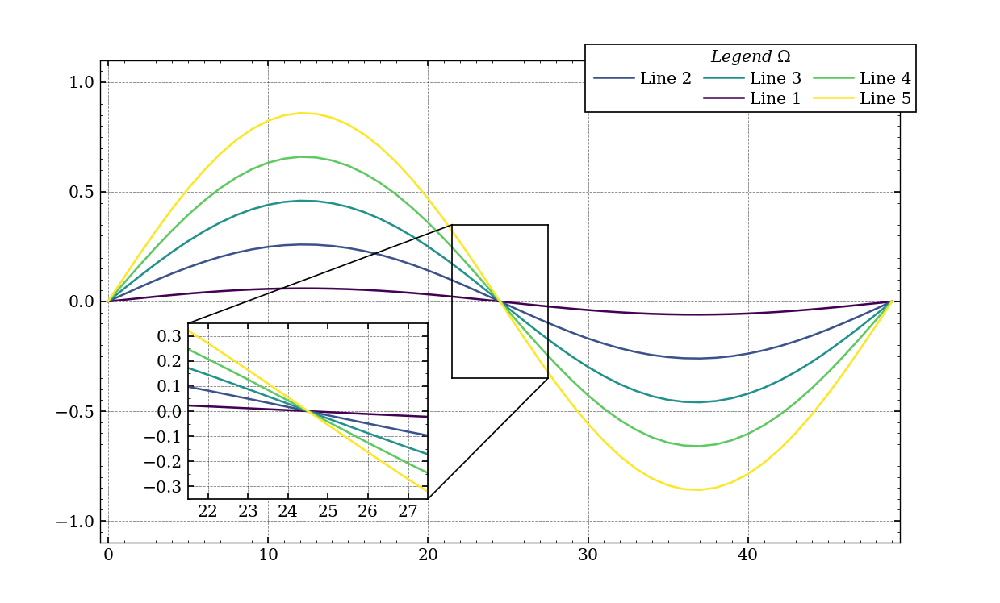

**journal_figure** is a library for journal-level data plotting.
The library comes with examples and pre-defined styles. 

Example plot:


---
*Install* PV_lib from GitHub (system-wise from console):
```console
python -m pip install git+https://github.com/martin-garaj/journal_figure.git@main
```

---
**RE**install PV_lib from GitHub (system-wise from console):
```console
python -m pip install git+https://github.com/martin-garaj/journal_figure.git@main --force-reinstall
```

---
**UN**install PV_lib from local (system-wise from console):

```console
python -m pip uninstall journal_figure
```

---
**How to:**:

```python
import journal_figure as jp
...
# use help(<function name>) when in doubt.
```


---
Initial commit:
```console
git remote add origin https://github.com/martin-garaj/journal_figure.git
git branch -M main
git push -u origin main
```

---
update PV_lib from local:
```console
cd ~
cd ./Desktop/CloudStorage/Projects/Journal_figure/repo/journal_figure
git add --all
git diff --cached --name-only
git commit -m "README update"
git push -u origin main
```

---
*Forced* push
```console
git push --set-upstream origin main -f
```

---
Remined to set proper conda environment:
```console
conda activate python3.9
conda deactivate
```


